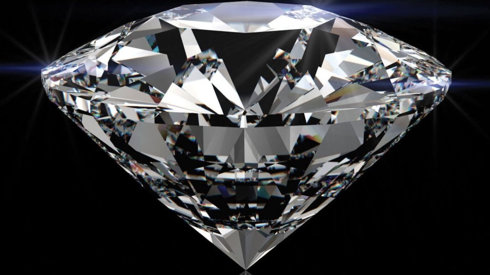

# Diamonds Kaggle Competition 

### Overview:
#
In this project I had to find the best machine learning model and params for a dataset of diamonds. It is a Kaggle competition which can be found [here](https://www.kaggle.com/c/diamonds-datamad1021-rev/overview).

### Process:
#
**Firstly**, I had cleaned the dataset of the diamonds, checking if there was any NaN values and transforming the categorical variables into ordinal. Also removing the columns which were not useful for the model, removing those with a high correlation amongst them. 

**Secondly**, I had to identify the best ML model to predict the price of the diamonds with the characterictics given. For it I have calculated the key metrics with 7 different models, and then selecting the one with the lowest RMSE value, which is the *Random Forest Classifier* model.

**Thirdly**, in order to decrease the value of my RMSE I had adjusted the hyperparameters using GridSearchCV and then applying the model again to my train data. 

**Finally**, once I had the model ready, I have apply the model to my test data and then submitting it to the competition in Kaggle. 

### Structure of project files:
#
This project contains: 
- A folder with 2 Jupyter Notebooks, one for cleaning and another one for modeling, predicting and evaluating.
- A folder with the datasets used.

### Libraries:
#
[pandas](https://pypi.org/project/pandas/)

[seaborn](https://seaborn.pydata.org/)

[numpy](https://numpy.org/)

[scikit-learn](https://scikit-learn.org/stable/)

